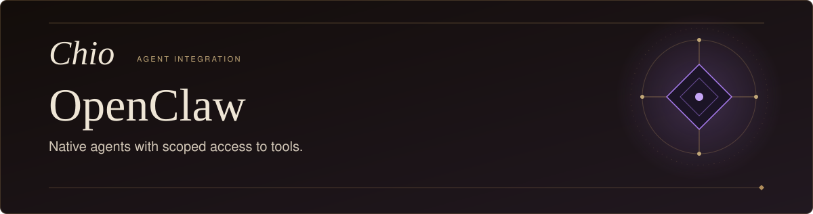
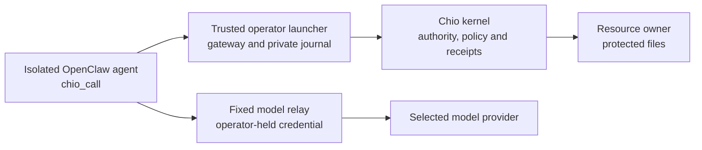

<p align="center">
  <picture>
    <source media="(max-width: 600px)" srcset="docs/assets/readme-hero-mobile.svg" />
    
  </picture>
</p>

<p align="center">
  <strong>Give OpenClaw scoped file access through the Chio kernel.</strong>
</p>

<p align="center">
  <a href="native/README.md">Native integration</a>&nbsp;&nbsp;&middot;&nbsp;&nbsp;
  <a href="#build-from-source">Build</a>&nbsp;&nbsp;&middot;&nbsp;&nbsp;
  <a href="native/README.md#run-a-file-workflow">Run</a>&nbsp;&nbsp;&middot;&nbsp;&nbsp;
  <a href="native/README.md#recovery-upgrade-and-removal">Recovery</a>&nbsp;&nbsp;&middot;&nbsp;&nbsp;
  <a href="#legacy-chat-gateway">Legacy gateway</a>&nbsp;&nbsp;&middot;&nbsp;&nbsp;
  <a href="https://github.com/backbay-labs/chio">Chio</a>
</p>

---

The native integration gives OpenClaw a `chio_call` tool for reading, writing,
editing and listing files at a separately owned resource. Chio checks the
caller's authority and executes the permitted request. OpenClaw receives a
verified result while the operator retains credentials and recovery state.

**Status:** `@chio/openclaw-kernel@0.1.0` is a restricted integration candidate
with [bounded real-host evidence](native/evidence/2026-09-10/static-kernel-native/README.md).
Full I01-I08 acceptance and a compatible published kernel/plugin release remain
separate gates. The instructions below build a local candidate from source.

## What you can do

Ask the agent to update a file in an approved remote workspace, read it back,
and list the directory to check the result:

```text
Use chio_call to write /workspace/approved.txt with "Draft",
edit it to "Ready", read it back, and list /workspace.
```

The supported mode makes three responsibilities explicit:

- **OpenClaw plans the work.** Its only enabled agent tool is `chio_call`.
- **Chio controls the resource.** Capability, scope and policy checks precede
  dispatch at the kernel's resource owner.
- **The operator owns recovery.** Signed results, the retained journal and
  independent resource observations determine whether uncertain work completed.

This mode runs a one-shot local agent in a pinned Docker image. Native shell,
file tools, web access, delegation, channels and background services are
disabled. See the [supported scope](native/README.md#supported-scope) before
choosing it for a workflow.

## How it fits together



The agent container has no protected filesystem mount or Docker socket. It
reaches only the launcher's gateway and fixed model relay. The parent process
keeps kernel and model credentials outside the container. The kernel's resource
owner performs the file operations; the integration never authorizes an
unrestricted native command after a policy precheck.

## Build from source

Use Node.js 22 or later. Start in a new checkout:

```sh
git clone https://github.com/backbay-labs/chio-open-claw-plugin.git
cd chio-open-claw-plugin/native
npm ci --ignore-scripts --no-audit --no-fund
npm run build
npm test
```

These commands check the native package without starting an agent. Its Chio
dependencies are committed under `native/vendor`; an adjacent Chio or bridge
checkout is unnecessary.

Continue with the [native installation and file workflow](native/README.md#build-and-install).
It covers packing a self-contained archive, building the OpenClaw image,
preparing operator authority and launching with a fresh state directory.
Protected execution also requires Docker, a compatible kernel resource service
and provider authentication. A successful package build alone does not establish
that boundary.

## Development and qualification

The native implementation is in [`native/src`](native/src), its launcher and
packaging tools in [`native/scripts`](native/scripts), and its component tests
in [`native/test`](native/test). Run the build and tests above from `native/`.

- [Native acceptance record](native/ACCEPTANCE.md): supported actions, exact
  artifacts and the limits of recorded tests.
- [Final static-kernel observations](native/evidence/2026-09-10/static-kernel-native/README.md):
  later local runs, failures, recovery and independent resource evidence.
- [Release qualification](docs/RELEASE-QUALIFICATION.md): source checks,
  packaging, provenance and promotion prerequisites.

Source/package CI checks the native package. Real-host acceptance and release
qualification are tracked separately.

## Legacy chat gateway

The root [`src/`](src) package, `@chio/openclaw@0.2.0`, contains the earlier
Slack, Discord and Telegram chat gateway. Its channel adapters, approval flows
and receipt webhook are separate from the native OpenClaw runtime integration.

The native setup does not deploy a bot, configure channels or install that
package. A chat approval or receipt webhook does not establish mediation of
native agent actions. Managed installation and the legacy gateway's deployment
and authentication flows require their own qualification; this README provides
no managed-service installation path.

## License

[Apache-2.0](LICENSE).
